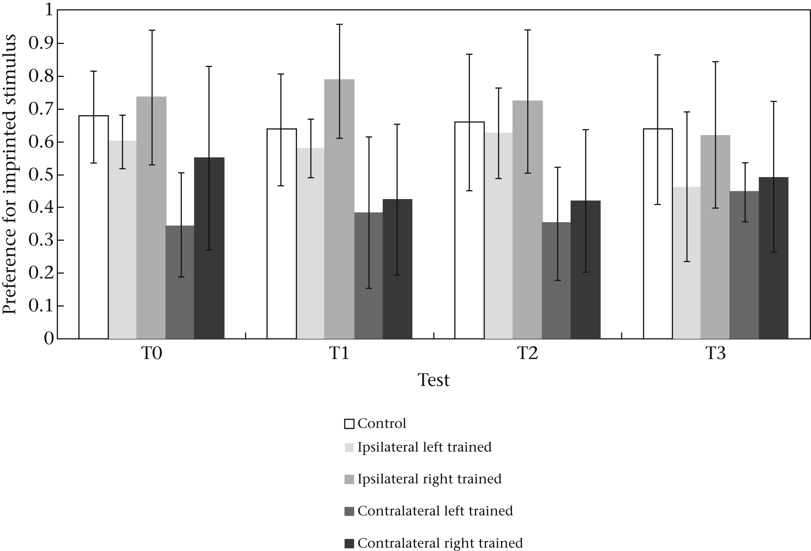

```{r setup, include=FALSE}
knitr::opts_chunk$set(
	echo = TRUE,
	warning = TRUE,
	message = TRUE,
	comment = "##",
	prompt = FALSE,
	tidy = TRUE,
	tidy.opts = list(blank = FALSE, width.cutoff = 75),
	fig.path = "img/FigA1.jpg",
	fig.align = "center"
)
```


Necessary packages

```{r}
library(readr)
library(ggplot2)
```

##Introduction

This paper investigated the effects of monocular imprinting on ducklings. Since birds do not have a corpus collosum, there is reduced transfer of information between their cerebral hemispheres. The authors performed two sets of experiments. Experiment 1 investigated if a duckling that only imprinted on a decoy with one eye (while the received no imprinting) would only show a preference for that decoy with the imprinted eye, or whether that information would transfer between hemispheres to allow the contralateral eye to also recognize the imprinted decoy. The figure I replicated summarizes the preferences found in the testing groups for this experiment. Experiment 2 investigated the effects of each eye having a different imprint on both monocular and binocolur preference tests. My descriptive and inferentical statistical reanalyses come from this experiment.

The data was in one data  file originally (data_monocularducks.xlsx), which I split up into 4 separate .csv files for my analyses and data visualization.


##Descriptive Statistic: Experiment 2, monocular group preference

This analysis is from the last paragraph of page 104 of the paper. It was looking at the monocular group of experiment 2, in which each eye was imprinted with a different decoy, and each eye was tested separately for preference. This was done to determine if information is shared between the eyes when each eye has a different imprint. The researchers looked to see what the preference percentages were for the left and right eyes, separately, and then ran a Kolmogorov-Smirnov test for normality on those two data sets.


Upload dataset 

```{r cars}
f<-"https://raw.githubusercontent.com/celeslie/Leslie-Caitlin-ADA-DATA-REANALYSIS-ASSIGNMENT/master/data_monocularducks_Ex2monocular.csv"
d <- read_csv(f, col_names = TRUE)
head(d)
```

Remove unnecessary columns

```{r}
d <- data.frame(cbind(d$`Test L IS +`, d$`Test R IS +`, d$`Test L NS +`, d$`Test R NS +`))
names(d) <- c("Test L IS +", "Test R IS +", "Test L NS +", "Test R NS +")
```

Combine "IS +" columns and "NS +" Columns

```{r}
d_IS<-stack(d, select = c("Test L IS +", "Test R IS +"))
d_NS<-stack(d, select = c("Test L NS +", "Test R NS +"))

d2<-data.frame(cbind(d_IS,d_NS))
names(d2)<-c("IS +", "IS Eye", "NS +", " NS Eye") 
```

Remove NAs

```{r}
d2<-d2[complete.cases(d2[ , c(1,3)]),]
```
              
Remove anyone with 0s in all columns

```{r}
d2<-d2[!(d2$`IS +`==0 & d2$`NS +`==0),]
```


IS preference for left versus right eye

```{r}
d2_left <- d2[d2$`IS Eye`=="Test L IS +",]
d2_right <- d2[d2$`IS Eye`=="Test R IS +",]
```

Convert left and right datasets to preference vectors - preference is proportion of approaches to the imprinted stimulus divided by total approaches (imprinted + novel stimuli)

```{r}
dv_left <- d2_left$`IS +`/(d2_left$`IS +` + d2_left$`NS +`)
dv_left
left_preference <- mean(dv_left)
left_preference

dv_right <-d2_right$`IS +`/(d2_right$'IS +' + d2_right$`NS +`)
dv_right
right_preference <- mean(dv_right)
right_preference
```

These percentages, when rounded to the nearest whole number, match the percentages reported in the article

Check for normal distribution with Kolmogorov-Smirnov Test

```{r}
sw_left <- shapiro.test(dv_left)
sw_left

sw_right <- shapiro.test(dv_right)
sw_right
```

I couldn't get the Kolmogorov-Smirnov normality test to work. However, the Shapiro-Wilk normality test gave me the same results as reported in the paper (both preferences normally distributed, with P>0.15).

##Inferential Statistic: Experiment 2, monocular group preference


This analysis also came from the last paragraph of page 104. Once the authors determined that the 
preferences from each eye were normally distributed, they combined the data from left and right eye to determine if the preference for the decoy imprinted with the testing eye would be signifcantly
greater than the preference for the decoy that was novel to that eye. To do this, they ran a two-tailed, one-sample T-test.


Get vector of preference data - preference is proportion of approaches to the imprinted stimulus divided by total approaches (imprinted + novel stimuli)

```{r}
dv<-d2$`IS +`/(d2$`IS +` + d2$`NS +`)
dv
```

Run two-tailed, one-sample t-test, with mu=0.5,  as the null hypothesis would be no preference for IS or NS, which would mean half the trials show a preference for IS

```{r}
t<-t.test(x=dv, mu=0.5, alternative="two.sided")
t
```

This matches the statistics they reported in the article for this test

##Data Visualization: Figure A1

This figures summarizes the imprinted stimulus preference by eye in each testing group in experiment 1. 

Upload datasets

```{r}
g <-"https://raw.githubusercontent.com/celeslie/Leslie-Caitlin-ADA-DATA-REANALYSIS-ASSIGNMENT/master/data_monocularducks_binocularcontrol.csv"
dbc <- read_csv(g, col_names = TRUE)
head(dbc)

h <- "https://raw.githubusercontent.com/celeslie/Leslie-Caitlin-ADA-DATA-REANALYSIS-ASSIGNMENT/master/data_monocularducks_monocularcontra.csv"
dmc <- read_csv(h, col_names = TRUE)
head(dmc)

i <- "https://raw.githubusercontent.com/celeslie/Leslie-Caitlin-ADA-DATA-REANALYSIS-ASSIGNMENT/master/data_monocularducks_monocularipsi.csv"
dmi <- read_csv(i, col_names = TRUE)
head(dmi)
```

Separate monocular data into left-eye and right-eye open

```{r}
dmil <- dmi[12:19,]
dmir <- dmi[1:8,]

dmcl <- dmc[12:19,]
dmcr <- dmc[1:8,]
```

Make vectors of calculated preferences for each category (preference = # IS+ / (# IS+ + # NS+ )), then make data frames of measure (t0, t1, t2, t3), test, mean preference, sd preference

```{r}
dbc_t0_pref <- dbc$`T0 IS +`/(dbc$`T0 IS +` + dbc$`T0 NS +`)
dbc_t0 <- data.frame(cbind("T0", "BC", mean(dbc_t0_pref), sd(dbc_t0_pref)))
names(dbc_t0) <- c("measure", "test", "mean", "sd")

dbc_t1_pref <- dbc$`T1 IS +`/(dbc$`T1 IS +` + dbc$`T1 NS +`)
dbc_t1 <- data.frame(cbind("T1", "BC", mean(dbc_t1_pref), sd(dbc_t1_pref)))
names(dbc_t1) <- c("measure", "test", "mean", "sd")

dbc_t2_pref <- dbc$`T2 IS +`/(dbc$`T2 IS +` + dbc$`T2 NS +`)
dbc_t2 <- data.frame(cbind("T2", "BC", mean(dbc_t2_pref), sd(dbc_t2_pref)))
names(dbc_t2) <- c("measure", "test", "mean", "sd")

dbc_t3_pref <- dbc$`T3 IS +`/(dbc$`T3 IS +` + dbc$`T3 NS +`)
dbc_t3 <- data.frame(cbind("T3", "BC", mean(dbc_t3_pref), sd(dbc_t3_pref)))
names(dbc_t3) <- c("measure", "test", "mean", "sd")


dmil_t0_pref <- dmil$`T0 IS +`/(dmil$`T0 IS +` + dmil$`T0 NS +`)
dmil_t0 <- data.frame(cbind("T0", "MIL", mean(dmil_t0_pref, na.rm = TRUE), sd(dmil_t0_pref, na.rm=TRUE)))
names(dmil_t0) <- c("measure", "test", "mean", "sd")

dmil_t1_pref <- dmil$`T1 IS +`/(dmil$`T1 IS +` + dmil$`T1 NS +`)
dmil_t1 <- data.frame(cbind("T1", "MIL", mean(dmil_t1_pref, na.rm=TRUE), sd(dmil_t1_pref, na.rm=TRUE)))
names(dmil_t1) <- c("measure", "test", "mean", "sd")

dmil_t2_pref <- dmil$`T2 IS +`/(dmil$`T2 IS +` + dmil$`T2 NS +`)
dmil_t2 <- data.frame(cbind("T2", "MIL", mean(dmil_t2_pref, na.rm=TRUE), sd(dmil_t2_pref, na.rm=TRUE)))
names(dmil_t2) <- c("measure", "test", "mean", "sd")

dmil_t3_pref <- dmil$`T3 IS +`/(dmil$`T3 IS +` + dmil$`T3 NS +`)
dmil_t3 <- data.frame(cbind("T3", "MIL", mean(dmil_t3_pref, na.rm=TRUE), sd(dmil_t3_pref, na.rm=TRUE)))
names(dmil_t3) <- c("measure", "test", "mean", "sd")

dmir_t0_pref <- dmir$`T0 IS +`/(dmir$`T0 IS +` + dmir$`T0 NS +`)
dmir_t0 <- data.frame(cbind("T0", "MIR", mean(dmir_t0_pref), sd(dmir_t0_pref)))
names(dmir_t0) <- c("measure", "test", "mean", "sd")

dmir_t1_pref <- dmir$`T1 IS +`/(dmir$`T1 IS +` + dmir$`T1 NS +`)
dmir_t1 <- data.frame(cbind("T1", "MIR", mean(dmir_t1_pref), sd(dmir_t1_pref)))
names(dmir_t1) <- c("measure", "test", "mean", "sd")

dmir_t2_pref <- dmir$`T2 IS +`/(dmir$`T2 IS +` + dmir$`T2 NS +`)
dmir_t2 <- data.frame(cbind("T2", "MIR", mean(dmir_t2_pref), sd(dmir_t2_pref)))
names(dmir_t2) <- c("measure", "test", "mean", "sd")

dmir_t3_pref <- dmir$`T3 IS +`/(dmir$`T3 IS +` + dmir$`T3 NS +`)
dmir_t3 <- data.frame(cbind("T3", "MIR", mean(dmir_t3_pref), sd(dmir_t3_pref)))
names(dmir_t3) <- c("measure", "test", "mean", "sd")

dmcl_t0_pref <- dmcl$`T0 IS +`/(dmcl$`T0 IS +` + dmcl$`T0 NS +`)
dmcl_t0 <- data.frame(cbind("T0", "MCL", mean(dmcl_t0_pref), sd(dmcl_t0_pref)))
names(dmcl_t0) <- c("measure", "test", "mean", "sd")

dmcl_t1_pref <- dmcl$`T1 IS +`/(dmcl$`T1 IS +` + dmcl$`T1 NS +`)
dmcl_t1 <- data.frame(cbind("T1", "MCL", mean(dmcl_t1_pref), sd(dmcl_t1_pref)))
names(dmcl_t1) <- c("measure", "test", "mean", "sd")

dmcl_t2_pref <- dmcl$`T2 IS +`/(dmcl$`T2 IS +` + dmcl$`T2 NS +`)
dmcl_t2 <- data.frame(cbind("T2", "MCL", mean(dmcl_t2_pref), sd(dmcl_t2_pref)))
names(dmcl_t2) <- c("measure", "test", "mean", "sd")

dmcl_t3_pref <- dmcl$`T3 IS +`/(dmcl$`T3 IS +` + dmcl$`T3 NS +`)
dmcl_t3 <- data.frame(cbind("T3", "MCL", mean(dmcl_t3_pref), sd(dmcl_t3_pref)))
names(dmcl_t3) <- c("measure", "test", "mean", "sd")

dmcr_t0_pref <- dmcr$`T0 IS +`/(dmcr$`T0 IS +` + dmcr$`T0 NS +`)
dmcr_t0 <- data.frame(cbind("T0", "MCR", mean(dmcr_t0_pref), sd(dmcr_t0_pref)))
names(dmcr_t0) <- c("measure", "test", "mean", "sd")

dmcr_t1_pref <- dmcr$`T1 IS +`/(dmcr$`T1 IS +` + dmcr$`T1 NS +`)
dmcr_t1 <- data.frame(cbind("T1", "MCR", mean(dmcr_t1_pref), sd(dmcr_t1_pref)))
names(dmcr_t1) <- c("measure", "test", "mean", "sd")

dmcr_t2_pref <- dmcr$`T2 IS +`/(dmcr$`T2 IS +` + dmcr$`T2 NS +`)
dmcr_t2 <- data.frame(cbind("T2", "MCR", mean(dmcr_t2_pref), sd(dmcr_t2_pref)))
names(dmcr_t2) <- c("measure", "test", "mean", "sd")

dmcr_t3_pref <- dmcr$`T3 IS +`/(dmcr$`T3 IS +` + dmcr$`T3 NS +`)
dmcr_t3 <- data.frame(cbind("T3", "MCR", mean(dmcr_t3_pref), sd(dmcr_t3_pref)))
names(dmcr_t3) <- c("measure", "test", "mean", "sd")
```

Bind into one data frame, make mean a numeric variable

```{r}
p <- data.frame(rbind(dbc_t0,dbc_t1,dbc_t2,dbc_t3,dmil_t0,dmil_t1,dmil_t2,dmil_t3,dmir_t0,dmir_t1,dmir_t2,dmir_t3,dmcl_t0,
           dmcl_t1,dmcl_t2,dmcl_t3,dmcr_t0,dmcr_t1,dmcr_t2,dmcr_t3))
p$mean=as.numeric(levels(p$mean))[p$mean]
p$sd=as.numeric(levels(p$sd))[p$sd]
```

Plot

```{r}
library(ggplot2)
ggplot(data=p, aes(x=measure, y=mean, fill=test)) +
  geom_bar(stat="identity", color='black', position=position_dodge()) +
  scale_y_continuous(limit=c(0,1)) +
  geom_errorbar(aes(ymin=mean-sd, ymax=mean+sd, width=0.2), position=position_dodge(0.9)) +
  labs(x="Test", y="Preference for Imprinted Stimulus") +
  ggtitle("Figure A1") +
  scale_fill_manual(values=c('gray100','gray77', 'gray47', 'gray54', 'gray20'))
```

Original image, for reference



  
